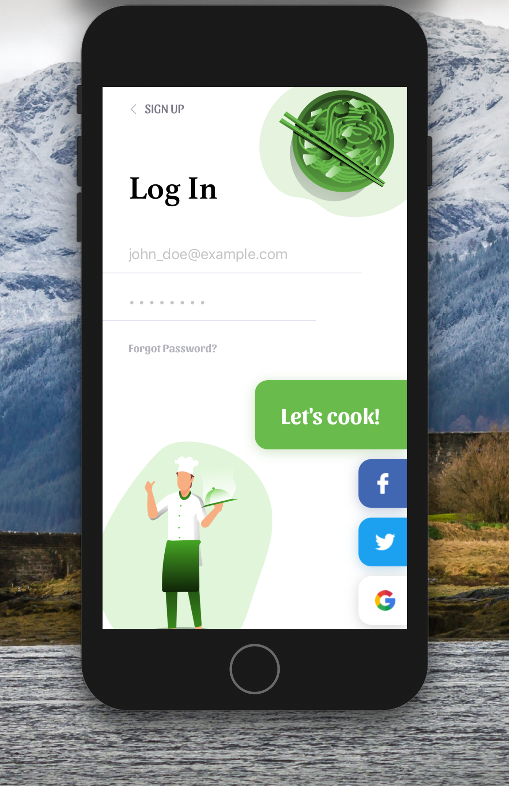
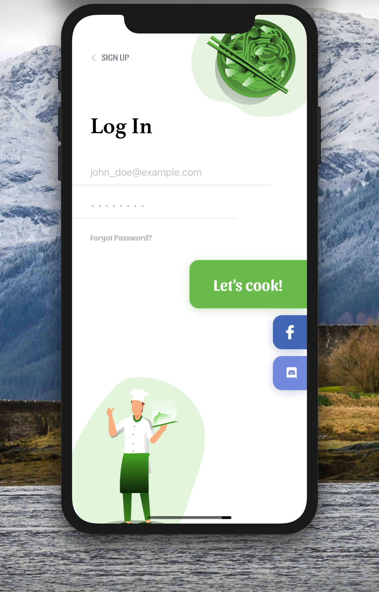

[](https://github.com/WrathChaos/react-native-social-login-screen)

[](https://www.npmjs.com/package/react-native-social-login-screen)
[](https://www.npmjs.com/package/react-native-social-login-screen)

[](https://opensource.org/licenses/MIT)
[](https://github.com/prettier/prettier)

<table>
  <tr>
    <td align="center">
      
    </td>
    <td align="center">
      
    </td>
   </tr>
</table>

<table>
  <tr>
    <td align="center">
      
    </td>
    <td align="center">
      
    </td>
   </tr>
</table>

# Installation

Add the dependency:

```bash
npm i react-native-social-login-screen
```

## Peer Dependencies

<h5><i>IMPORTANT! You need install them</i></h5>

```js
"react-native-androw": ">= 0.0.34"
"react-native-spinkit": "^1.5.1"
```

# Usage

## Import

```jsx
import SocialLoginScreen from "react-native-social-login-screen";
```

## Fundamental Usage

```jsx
<SocialLoginScreen
  onSignUpPress={() => {}}
  onLoginPress={() => {}}
  onForgotPasswordPress={() => {}}
  onUserNameChangeText={(username) => console.log("Username: ", username)}
  onPasswordChangeText={(password) => console.log("Password: ", password)}
  rightTopAssetImageSource={require("./assets/ramen.png")}
  leftBottomAssetImageSource={require("./assets/chef.png")}
/>
```

## Advanced Usage

```jsx
<SocialLoginScreen
  onUserNameChangeText={(username) => console.log("Username: ", username)}
  onPasswordChangeText={(password) => console.log("Password: ", password)}
  onSignUpPress={() => {}}
  onLoginPress={() => {}}
  onForgotPasswordPress={() => {}}
  enableFacebookLogin
  onFacebookLoginPress={() => {}}
  enableDiscordLogin
  onDiscordLoginPress={() => {}}
  enableTwitterLogin
  onTwitterLoginPress={() => {}}
  enableGoogleLogin
  onGoogleLoginPress={() => {}}
  rightTopAssetImageSource={require("./assets/ramen.png")}
  leftBottomAssetImageSource={require("./assets/chef.png")}
  signUpTextStyle={{
    fontFamily: "Sansita-Regular",
  }}
  loginTextStyle={{
    fontFamily: "Athelas-Bold",
  }}
  forgotPasswordTextStyle={{
    fontFamily: "Sansita-Bold",
  }}
/>
```

# Configuration - Props

## Fundamentals

| Property                   |     Type     |        Default         | Description                                                           |
| -------------------------- | :----------: | :--------------------: | --------------------------------------------------------------------- |
| onLoginPress               |   function   |       undefined        | fundamental onLoginPress functionality for your own logic             |
| onSignUpPress              |   function   |       undefined        | handle sign-up button is pressed                                      |
| onForgotPasswordPress      |   function   |       undefined        | handle forgot password button is pressed                              |
| rightTopAssetImageSource   | image-source |       undefined        | set the right top aligned asset with your own image source            |
| leftBottomAssetImageSource | image-source |       undefined        | set the left bottom aligned asset with your own image source          |
| backArrowImageSource       | image-source |        default         | set the sign-up button's back button asset with your own image source |
| usernamePlaceholder        |    string    | "john_doe@example.com" | change the username TextField's placeholder                           |
| passwordPlaceholder        |    string    |   "• • • • • • • •"    | change the password TextField's placeholder                           |
| onUserNameChangeText       |   function   |       undefined        | handle username TextField's onChangeText                              |
| onPasswordChangeText       |   function   |       undefined        | handle password TextField's onChangeText                              |

## Social Buttons

| Property             |   Type   |      Default       | Description                              |
| -------------------- | :------: | :----------------: | ---------------------------------------- |
| loginText            |  string  |   "Let's cook!"    | change the login button's text           |
| signUpText           |  string  |     "Sign Up"      | change the sign up button's text         |
| loginTitleText       |  string  |      "Log In"      | change the login title's text            |
| forgotPasswordText   |  string  | "Forgot Password?" | change the forgot password button's text |
| enableFacebookLogin  | boolean  |       false        | enable the Facebook login button         |
| enableTwitterLogin   | boolean  |       false        | enable the Twitter login button          |
| enableGoogleLogin    | boolean  |       false        | enable the Google login button           |
| enableDiscordLogin   | boolean  |       false        | enable the Discord login button          |
| onFacebookLoginPress | function |     undefined      | handle Facebook login button is pressed  |
| onTwitterLoginPress  | function |     undefined      | handle Twitter login button is pressed   |
| onGoogleLoginPress   | function |     undefined      | handle Google login button is pressed    |
| onDiscordLoginPress  | function |     undefined      | handle Discord login button is pressed   |

## Customization

| Property                   | Type  | Default | Description                                                     |
| -------------------------- | :---: | :-----: | --------------------------------------------------------------- |
| loginTextStyle             | style | default | change or override the default styling for login text           |
| signUpTextStyle            | style | default | change or override the default styling for sign-up text         |
| forgotPasswordTextStyle    | style | default | change or override the default styling for forgot password text |
| loginButtonShadowColor     | style | default | change the default shadow color for login button                |
| loginButtonBackgroundColor | style | #69bc4c | change the default background color for login button            |
| usernameTextFieldStyle     | style | default | change or override the default styling for username TextField   |
| passwordTextFieldStyle     | style | default | change or override the default styling for password TextField   |

<i>**More customization is in coming...**</i>

## Future Plans

- [x] ~~LICENSE~~
- [ ] More Customization Options
- [ ] Add custom `SocialButton` instead of default ones
- [ ] Built-in Sign-Up Screen and its navigation with animation
- [ ] Write an article about the lib on Medium

## Author

FreakyCoder, kurayogun@gmail.com

## License

React Native Social Login Screen is available under the MIT license. See the LICENSE file for more info.

```

```
